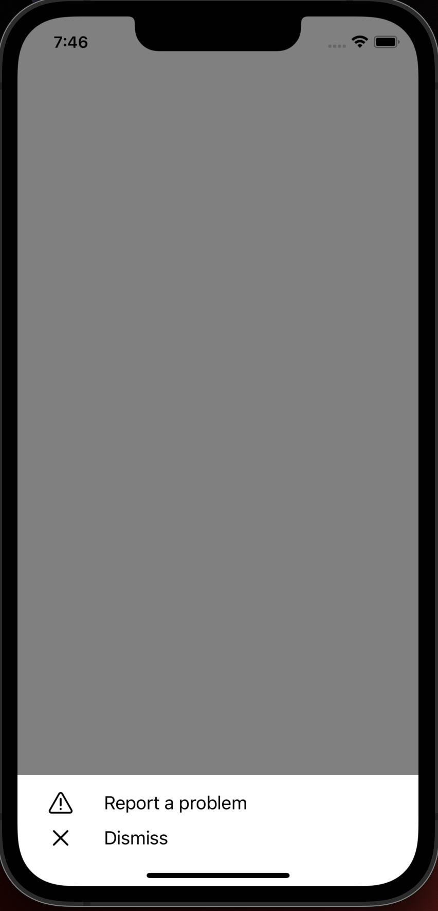

# `react-native-shake-to-report`

By adding this library to your app, the user will have the ability to shake
the phone and be prompted with a menu of options.



## Installation

```sh
npm install react-native-shake-to-report
```

or

```sh
yarn add react-native-shake-to-report
```
On iOS, install cocoapods:

```bash
cd ios
pod install
```

## Usage

### Example

```javascript
import Shkr from 'react-native-shake-to-report';
```

```javascript
const extraMenuOptions = [{
  icon: extraItemIcon,
  title: "Extra Item Title",
  action: handleExtraItem,
}];

const reportIssue = (deviceInfo) => {
  // your code here
};

return (
  <Shkr
    items={extraMenuOptions}
    email='example@example.com'
    reportIssue={(deviceInfo) => reportIssue(deviceInfo)}
  />
);
```

### Props

| Prop name      | Type     | Description                                                                                                       |
|----------------|----------|-------------------------------------------------------------------------------------------------------------------|
| items          | array    | An array of objects, each one having the 'icon', 'title' and 'action' keys. Each object represents a menu option. |
| reportIssue    | function | A callback function invoked when the 'Report a problem' option was selected.                                      |
| email          | string   | Used to receive the device information after the 'Report a problem' option was selected.                          |
| reportIcon     | element  | Replaces the default report icon.                                                                                 |
| dismissIcon    | element  | Replaces the default dismiss icon.                                                                                |
| containerStyle | object   | Replaces the default container styles.                                                                            |
| listItemStyle  | object   | Replaces the default style of each item in the list.                                                              |

